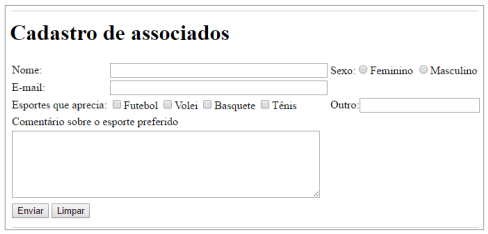

Este exercício, tem como objetivo, criar uma página de cadastro, para desenvolver o
formulário utilize o elemento table e os campos input, radio, checkbox, textarea e submit.
5) Desenvolva a página conforme ilustração abaixo. Definir uma largura para os campos do
formulário, o campo de comentário, definir largura igual a 60 e altura igual a 6.
6) Salve a página com o nome, cadastro-associados.html, como é mostrado na imagem
acima.
7) Verifique se funcionou no navegador, conforme o exemplo acima.
